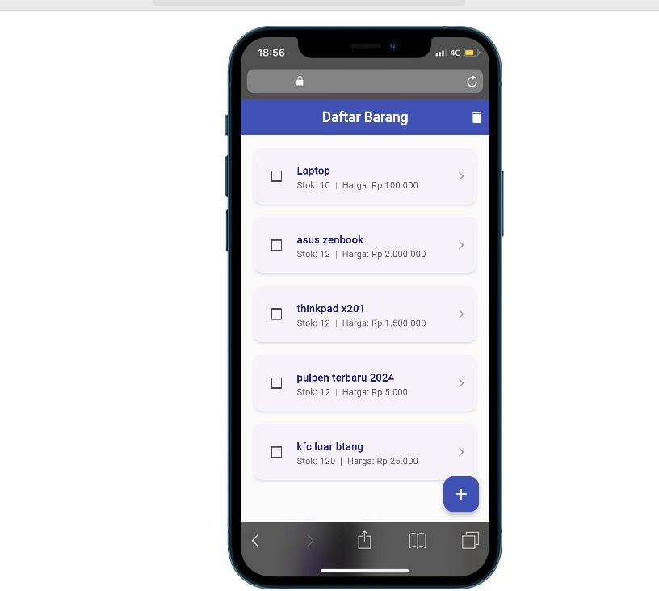
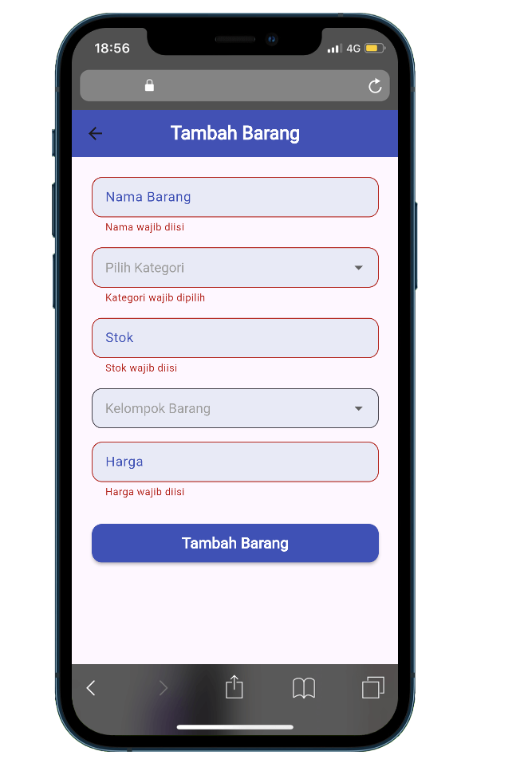
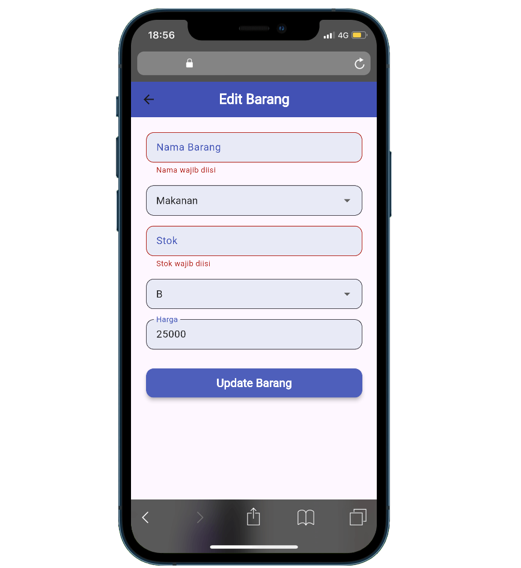

# Mobile Product Management App

Aplikasi mobile Product Management ini dibuat menggunakan **Flutter** dengan **GetX** sebagai state management. Proyek ini mendemonstrasikan **CRUD** untuk data produk dengan integrasi backend menggunakan **NestJS** dan database **MySQL**.

## Fitur

* **Create**: Menambahkan produk baru.
* **Read**: Melihat daftar produk.
* **Update**: Mengedit informasi produk.
* **Delete**: Menghapus produk.
* **Integrasi Backend**: Terhubung dengan API NestJS.
* **State Management**: Menggunakan GetX untuk reaktivitas data.


## Teknologi yang Digunakan

* **Flutter**: Framework untuk membangun aplikasi mobile.
* **GetX**: State management dan routing.
* **NestJS**: Backend API untuk CRUD.
* **MySQL**: Database untuk menyimpan data produk.

## Struktur Proyek

```
/lib
  /controllers    # Controller untuk GetX
  /models         # Model data produk
  /views          # Halaman UI Flutter
  /services       # Service API untuk CRUD
```

## Instalasi

1. Clone repository ini

```bash
git clone <repository_url>
```

2. Install dependencies Flutter

```bash
flutter pub get
```

3. Jalankan aplikasi

```bash
flutter run
```

## Konfigurasi Backend

1. Pastikan **NestJS** backend berjalan.
2. Sesuaikan `baseUrl` di `services/api_service.dart` dengan alamat backend.
3. Pastikan database MySQL sudah dikonfigurasi dan migrasi tabel dilakukan.

## Contoh CRUD API Endpoint

* **GET /barang** : Mendapatkan semua produk
* **POST /barang** : Menambahkan produk baru
* **PUT /barang/\:id** : Mengupdate produk
* **DELETE /barang/\:id** : Menghapus produk

## Lisensi

Proyek ini bersifat **open-source** dan dapat digunakan sebagai referensi belajar.


## Tampilan Aplikasi

### 1. List Barang

*Gambar 1. Menampilkan semua barang yang tersedia*

### 2. Tambah Barang

*Gambar 2. Form untuk menambahkan barang baru*

### 3. Edit Barang

*Gambar 3. Form untuk mengubah data barang*
